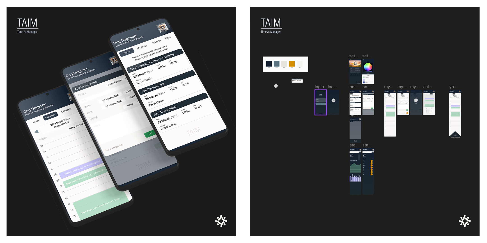

# Pushing the boundaries of Microsoft Power Apps

I recently got tasked to evaluate Microsoft Power Apps. With a team of developers at Bright Skills we set off.

I created a design that I knew would be a challenge to implement. This article is asdhnakdlams

Fun project, still working on the backend with custom API and custom Keras model.

Full article will be posted here or on LinkedIn soon!

